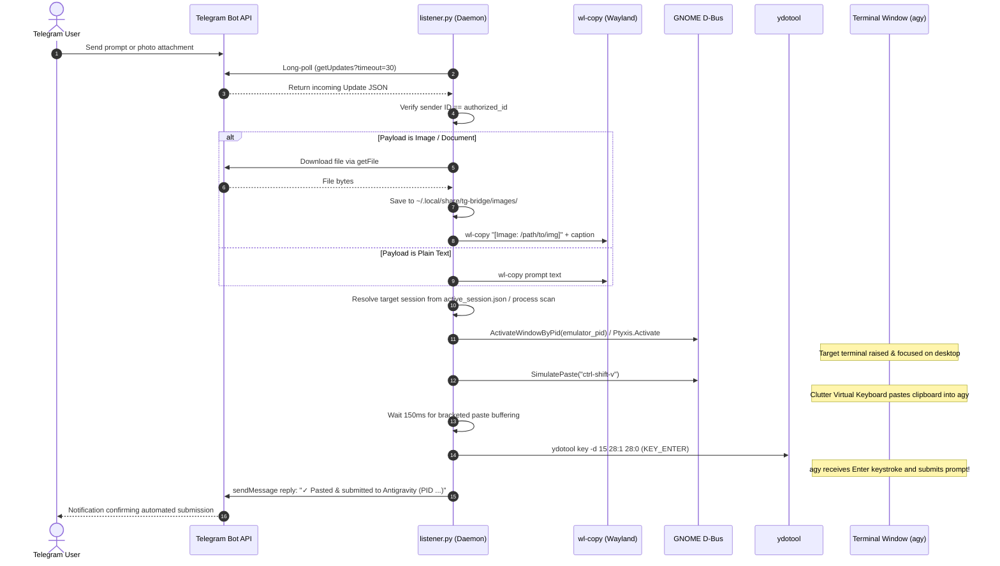
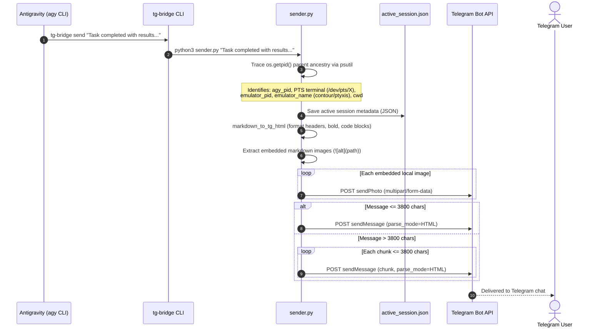
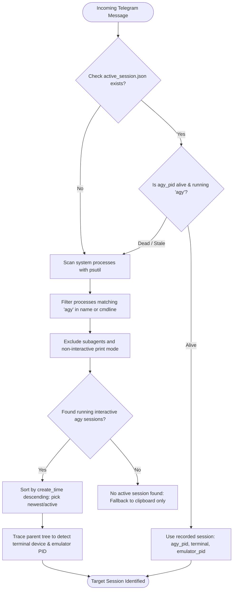
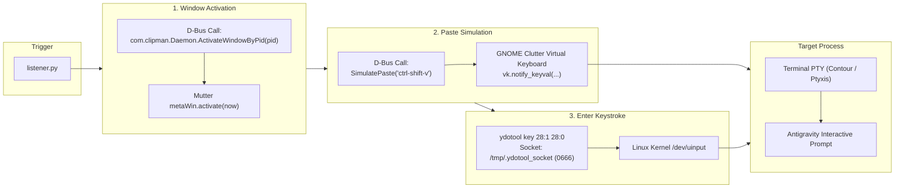

# Architecture: Antigravity Telegram Bridge (`tg-bridge`)

`tg-bridge` is a bidirectional, headless bridge linking an authorized Telegram user directly to their active **Google Antigravity (`agy`)** CLI development session on Linux (Wayland / GNOME).

It allows mobile prompt submission, screenshot analysis, and bidirectional AI pairing with automated input staging, terminal window focusing, and command submission.

---

## 1. High-Level System Architecture

```mermaid
flowchart TD
    subgraph TelegramCloud["Telegram Cloud"]
        UserMobile["Authorized User (Mobile/Desktop App)"]
        BotAPI["Telegram Bot API (api.telegram.org)"]
        UserMobile <--> BotAPI
    end

    subgraph HostSystem["Linux Host (Wayland / GNOME 50)"]
        subgraph Services["Background Services"]
            TGService["tg-bridge.service (Systemd User)"]
            ListenerDaemon["listener.py (Daemon)"]
            TGService --> ListenerDaemon
            YDoToolService["ydotool.service (System Daemon)"]
        end

        subgraph LocalState["State & Storage (~/.local/share/tg-bridge/)"]
            Creds["~/Documents/tg.txt (Token & User ID)"]
            ActiveSession["active_session.json (PID, PTS, Emulator)"]
            ImagesDir["images/ (Downloaded Media)"]
        end

        subgraph DesktopSession["User Desktop Session (Wayland)"]
            WLClipboard["Wayland Clipboard (wl-copy)"]
            ClipmanExt["Clipman GNOME Shell Extension (Clutter VK)"]
            ActiveTerminal["Active Terminal (Contour / Ptyxis)"]
            AgyCLI["Antigravity CLI (agy session)"]

            ActiveTerminal --> AgyCLI
        end

        subgraph OutboundCLI["Outbound CLI Controller"]
            TGCLI["tg-bridge CLI (~/.local/bin/tg-bridge)"]
            SenderScript["sender.py"]
            TGCLI --> SenderScript
        end
    end

    %% Inbound Connections
    BotAPI -->|Long-polling getUpdates| ListenerDaemon
    Creds -.->|Read Auth| ListenerDaemon
    Creds -.->|Read Auth| SenderScript

    ListenerDaemon -->|1. Download Photos/Docs| ImagesDir
    ListenerDaemon -->|2. Stage Prompt| WLClipboard
    ListenerDaemon -->|3. Focus Window| ClipmanExt
    ListenerDaemon -->|4. Paste (Ctrl+Shift+V)| ClipmanExt
    ListenerDaemon -->|5. Submit (KEY_ENTER)| YDoToolService
    YDoToolService -->|Synthesize Return| ActiveTerminal
    ClipmanExt -->|Synthesize Paste| ActiveTerminal

    %% Outbound Connections
    AgyCLI -->|Runs 'tg-bridge send'| TGCLI
    SenderScript -->|Trace caller process tree| ActiveSession
    ActiveSession -.->|Read target session| ListenerDaemon
    SenderScript -->|POST sendMessage / sendPhoto| BotAPI
```

---

## 2. Inbound Message Pipeline (Telegram to `agy`)

When the user sends a text prompt or screenshot from Telegram, the bridge automatically ingests the payload, resolves the target session, raises the terminal, pastes the prompt, and submits it.



---

## 3. Outbound Response Pipeline (`agy` to Telegram)

When `agy` generates a response or needs to communicate with the user on Telegram, it invokes `tg-bridge send "<message>"`.



---

## 4. Session Resolution Strategy

When an incoming message arrives, `listener.py` needs to determine *which* `agy` session to paste into:



---

## 5. Wayland Virtual Input & Window Focusing

GNOME Mutter on Wayland restricts arbitrary synthetic keypresses and window focus stealing for security. `tg-bridge` bypasses this reliably without requiring root privileges during operation:


