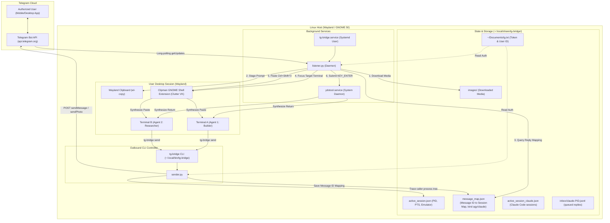
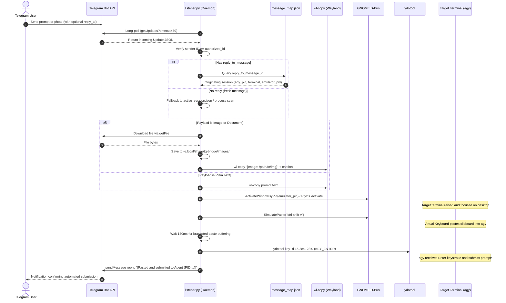
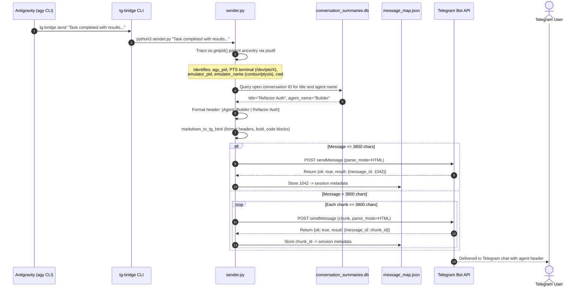
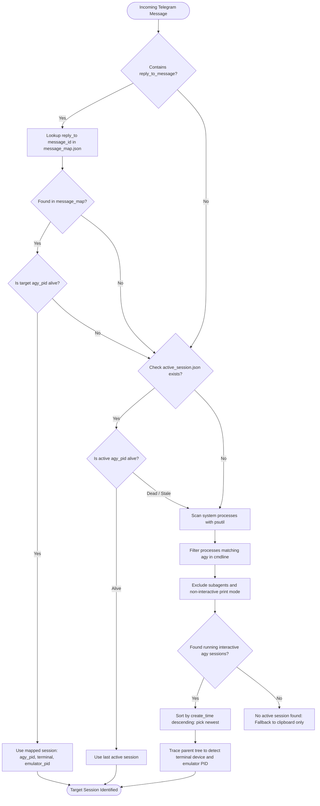
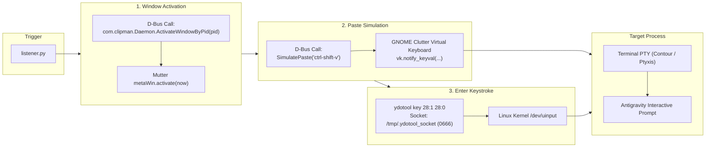

# Architecture: Antigravity Telegram Bridge (tg-bridge)

tg-bridge is a bidirectional, headless bridge linking an authorized Telegram user directly to their active Google Antigravity (agy) CLI development sessions on Linux (Wayland / GNOME).

It allows mobile prompt submission, screenshot analysis, and multi-agent coordination with automated input staging, terminal window focusing, and command submission.

---

## 1. High-Level System Architecture

---

## 2. Inbound Message Pipeline & Multi-Agent Routing

When the user sends a prompt from Telegram, the bridge determines whether it is a reply to an existing agent turn, focuses the respective window, and injects the turn.

---

## 3. Outbound Response Pipeline (agy to Telegram)

When agy generates a response or needs to communicate with the user on Telegram, it invokes `tg-bridge send "<message>"`.

---

## 4. Multi-Agent Session Resolution Decision Tree

---

## 5. Claude Code Routing (inbox, no input injection)

Claude Code runs as a `claude` process (`~/.config/Claude/claude-code/<ver>/claude`) spawned by the Claude desktop app. It has no terminal or targetable window, so tg-bridge never pastes into it. agy and Claude Code are kept fully separate.

Outbound (`sender.py`):
- Walks the caller's ancestors. If a process named `claude` (or whose argv[0] contains `/claude-code/`) is found before any process named `agy`, the session is `{kind: "claude", claude_pid, claude_create_time, cwd, agent: "Claude Code", title, timestamp}`.
- Claude sessions are upserted into `active_session_claude.json` (keyed by pid, newest 20). `active_session.json` stays agy-only and agy sessions are recorded with `kind: "agy"`.
- Every sent message ID is mapped to its session in `message_map.json`. `--no-record` skips both writes; the listener uses it for all acks.

Inbound (`listener.py`, `resolve_route`), in order:
1. Reply to a `kind: "claude"` message: if the pid is alive and still the same `claude` process (create time matches), append `{update_id, message_id, date, text, image_path, caption}` to `inbox/claude-<pid>.jsonl` under a lock and ack `Queued for Claude Code | <title> (PID n)`. If it has ended, ack that the message was not delivered. Never falls back to agy.
2. Reply to an agy message (or a legacy entry without `kind`) whose agy pid is alive: agy paste path, unchanged.
3. Text or caption starting with `/claude `: prefix stripped, queued to the most recent live session in `active_session_claude.json`; if none is alive, ack and drop.
4. Anything else: unchanged agy path (active_session.json, else newest agy process, else clipboard only).

Claude routes use only `notify-send`: no `wl-copy`, no window focus, no paste, no `ydotool`.

Reading (`inbox.py`, `tg-bridge inbox`): resolves the caller's `claude_pid` the same way, prints `[tg <message_id>] <text> [Image: <path>]` lines, and under the same lock moves consumed lines to `claude-<pid>.done.jsonl`. `--peek` does not consume; `--wait [SECONDS]` polls every 2s (default 1800s) and exits 3 on timeout; exit 2 outside Claude Code.

---

## 6. Wayland Virtual Input & Window Focusing

GNOME Mutter on Wayland restricts arbitrary synthetic keypresses and window focus stealing for security. tg-bridge bypasses this reliably without requiring root privileges during operation:

