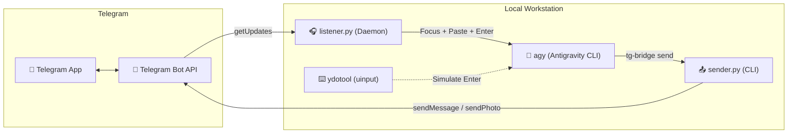

# 🛰️ tg-bridge: Antigravity Telegram Bridge

An intelligent, headless bridge linking **Telegram** directly to your active **Google Antigravity (`agy`)** CLI coding session on Linux (Wayland / GNOME).

Send prompts, code snippets, and image attachments from your phone via Telegram. `tg-bridge` automatically identifies your active `agy` terminal session, brings the window to focus, pastes the input (`Ctrl+Shift+V`), and presses `Enter` to submit the turn automatically.

---

## ✨ Features

- **Automated Session Discovery**: Tracks which `agy` session is actively talking. When multiple terminal windows exist, it targets the one currently communicating with Telegram or the active session.
- **Wayland Window Focus & Input Injection**: Natively raises the target terminal window on GNOME Wayland and simulates `Ctrl+Shift+V` followed by `KEY_ENTER` without requiring manual intervention.
- **Image & Screenshot Support**: Photos and image documents sent via Telegram are downloaded to `~/.local/share/tg-bridge/images/` and automatically formatted as `[Image: /path/to/image]` in the input prompt.
- **Rich Outbound Formatting**: `tg-bridge send` automatically translates Markdown (headers, bold, italics, code blocks) into Telegram-compliant HTML and splits oversized outputs into clean chunks.
- **Desktop Notifications**: Provides immediate desktop feedback using `notify-send` with thumbnail previews.

---

## 📐 Architecture Overview



For complete sequence diagrams and internal design, see [ARCHITECTURE.md](ARCHITECTURE.md).

---

## 🚀 Quick Start

### 1. Requirements
- Linux (Fedora / Ubuntu / Arch with GNOME Wayland or X11)
- Python 3.9+ with `psutil`
- `wl-clipboard` (`wl-copy`)
- `ydotool` (configured with systemd service)

### 2. Setup Credentials
Create `~/Documents/tg.txt` containing your Telegram Bot Token on line 1 and your authorized user ID on line 2:
```text
1234567890:ABCdefGHIjklMNOpqrSTUvwxYZ
id: 987654321
```

### 3. Installation
Clone the repository and run the installer:
```bash
git clone https://github.com/jendermine/tg-bridge.git ~/projects/tg-bridge
cd ~/projects/tg-bridge
./install.sh
```

### 4. Start the Service
```bash
tg-bridge start
```

---

## 🛠️ CLI Usage

`tg-bridge` includes a management CLI:

```bash
# Service management
tg-bridge start       # Start the bridge daemon
tg-bridge stop        # Stop the bridge daemon
tg-bridge restart     # Restart the daemon
tg-bridge status      # View daemon status
tg-bridge logs        # Stream real-time logs (journalctl)

# Outbound messaging
tg-bridge send "Task finished! Here are the results..."
tg-bridge send /path/to/screenshot.png "Visual review"
cat report.md | tg-bridge send
```

---

## 🔄 Agentic Workflow Integration

When pairing with Google Antigravity, add the following instruction to your `AGENTS.md` or `GEMINI.md`:

```markdown
## Telegram Bridge Service (`tg-bridge`)

When the user requests Telegram updates or when running headless/remote tasks:
- **Send update**: `tg-bridge send "<message>"`
- **Send image**: `tg-bridge send /path/to/image.png "<caption optional>"`
- Responses generated for the user should be mirrored to Telegram via `tg-bridge send`.
```

---

## 📄 License
MIT License. Created for pairing Antigravity with Telegram.
