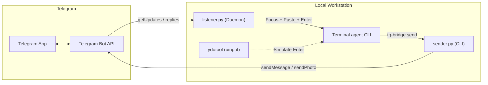

# tg-bridge: Telegram Bridge for Coding Agents

A headless bridge linking Telegram directly to active coding-agent sessions on Linux (Wayland / GNOME): terminal CLI agents and Claude Code.

Send prompts, code snippets and image attachments from Telegram. The bridge automatically identifies the target session, brings the terminal window to focus, pastes the input (Ctrl+Shift+V) and presses Enter to submit the turn automatically.

When running multiple agents across different workspaces or terminals, replying directly to an agent's message on Telegram routes your response exclusively to that specific agent session.

---

## Emergency hotline

The listener handles these Telegram commands itself, so they work even when the
Claude desktop app (or any agent session) is hung or closed:

| Command | What it does |
|---|---|
| `/status` | Load, memory, heaviest processes, running builds/pushes |
| `/stop` | Halts Claude (every Claude Code tool call is blocked by a hook until `/resume`) and stops runaway work: Gradle/Kotlin daemons, git push/pack-objects, adb screenrecord |
| `/resume` | Lifts the halt |
| `/killapp` | Force-quits a hung Claude desktop app |
| `/ask [project] <message>` | Read-only help in `~/projects/<project>` (default `keyboardme`). Uses Claude Code (a fork of that project's latest conversation) if its CLI is signed in, otherwise the terminal agent CLI in plan mode. |
| `/do [project] <message>` | Like `/ask`, but the terminal agent may edit files and run commands in the project. |
| `/help` | Lists the commands |

The halt used by `/stop` is enforced by a Claude Code `PreToolUse` hook, so an agent cannot
restart what was stopped. Add it once to `~/.claude/settings.json` (`install.sh` links the script):

```json
{ "hooks": { "PreToolUse": [ { "matcher": "*", "hooks": [
  { "type": "command", "command": "$HOME/.local/share/tg-bridge/halt-hook.sh" } ] } ] } }
```

---

## Features

- Multi-Agent Routing: Every outbound message tags the originating agent name and conversation title, recording the Telegram message ID. Replying to a message on Telegram routes your prompt directly to that specific agent session.
- Automated Session Discovery: Dynamically tracks which terminal agent session is actively communicating. Falls back to the most recently active session when messages are not replies.
- Wayland Window Focus and Input Injection: Natively raises the target terminal window on GNOME Wayland and simulates Ctrl+Shift+V followed by KEY_ENTER via kernel uinput (ydotool).
- Image and Screenshot Support: Photos and image documents sent via Telegram are downloaded to ~/.local/share/tg-bridge/images/ and automatically formatted as [Image: /path/to/image] in the input prompt.
- Rich Outbound Formatting: Translates Markdown (headers, bold, italics, code blocks) into Telegram HTML and splits oversized outputs into chunks.
- Desktop Notifications: Provides immediate desktop feedback using notify-send with thumbnail previews.
- Claude Code Sessions: Claude Code has no terminal to paste into, so replies to its messages are queued in a per-session inbox it reads with `tg-bridge inbox`. Kept fully separate from terminal agents (see below).
- Status Reports: `tg-bridge report` sends a bold title and one `Label: value` line per argument, so progress updates look the same every time.

---

## Architecture Overview



For complete sequence diagrams, reply-routing flows and internal design, see [ARCHITECTURE.md](ARCHITECTURE.md).

---

## Quick Start

### 1. Requirements
- Linux (Fedora / Ubuntu / Arch with GNOME Wayland or X11)
- Python 3.9+ with psutil
- wl-clipboard (wl-copy)
- ydotool (configured with systemd service and uinput access)

Tested on Fedora 44 Workstation (GNOME Shell 50.5, Wayland), kernel 7.2.9, Python 3.14.8.

### 2. Setup Credentials
Create ~/Documents/tg.txt containing your Telegram Bot Token on line 1 and your authorized user ID on a later line prefixed with `id:`:
```text
1234567890:ABCdefGHIjklMNOpqrSTUvwxYZ
id: 987654321
```
The values above are placeholders. The file lives outside the repo and is the only place the token and ID are read from; `tg.txt`, `*.token`, `*.key` and `credentials.json` are also in `.gitignore`.

### 3. Installation
Clone the repository and run the installer:
```bash
git clone https://github.com/jendermine/tg-bridge.git ~/projects/tg-bridge
cd ~/projects/tg-bridge
./install.sh
```

### 4. Setup Input Injection Permissions
Run the uinput setup script once to grant ydotool permissions:
```bash
./integrations/setup-uinput.sh
```

### 5. Start the Service
```bash
tg-bridge start
```

---

## CLI Usage

tg-bridge includes a management and dispatch CLI:

```bash
# Service management
tg-bridge start       # Start the bridge daemon
tg-bridge stop        # Stop the bridge daemon
tg-bridge restart     # Restart the daemon
tg-bridge status      # View daemon status
tg-bridge logs        # Stream real-time logs (journalctl)

# Outbound messaging (automatically detects agent and conversation title)
tg-bridge send "Task finished! Here are the results..."
tg-bridge send /path/to/screenshot.png "Visual review"
cat report.md | tg-bridge send

# Explicit agent or title overrides
tg-bridge send --agent "Database Refactorer" --title "Schema Migration" "Migration completed."
tg-bridge send --no-header "Raw message without header tag"
tg-bridge send --no-record "Send without recording a session or message mapping"

# Status report: bold title, then one "Label: value" line per argument
tg-bridge report "Build status" "Stage=compile 99%" "Errors=none" "ETA=21:30 UTC"

# Claude Code sessions only
tg-bridge inbox                 # print queued replies for this session and mark them read
tg-bridge inbox --peek          # print without marking read
tg-bridge inbox --wait [SECONDS] # block until a reply arrives (default 1800s, exit 3 on timeout)
```

---

## Claude Code Sessions

Claude Code runs as a `claude` process spawned by the Claude desktop app, with no terminal or window to paste into. tg-bridge detects it by walking the caller's process tree and handles it through a separate inbox instead of input injection.

- Send: `tg-bridge send "<message>"` from a Claude Code tool shell. The header reads `[Agent: Claude Code | <cwd basename or --title>]`.
- Receive: reply on Telegram to that message. The listener appends it to `~/.local/share/tg-bridge/inbox/claude-<pid>.jsonl` and acks `Queued for Claude Code | <title> (PID n)`.
- Read: `tg-bridge inbox` prints `[tg <message_id>] <text> [Image: <path>]` lines and moves them to `claude-<pid>.done.jsonl`. `--peek` leaves them unread. `--wait [SECONDS]` blocks until at least one message exists (polls every 2s, default 1800s, exit 3 on timeout).
- Exit codes: 0 ok, 2 not called from a Claude Code session, 3 `--wait` timed out.
- Fresh message to Claude: start it with `/claude ` (the prefix is stripped). It goes to the most recently active live Claude Code session.

### Separation rules (terminal agents and Claude Code never interfere)

- `active_session.json` is for terminal agents only. Claude Code sessions are recorded in `active_session_claude.json`. `message_map.json` entries carry `"kind": "agy"` or `"kind": "claude"`; entries without `kind` are terminal agent entries.
- Fresh (non-reply) messages always follow the terminal agent behaviour (active session, else newest agent process), even if Claude Code sent last. Only `/claude ` messages go to Claude Code; if no Claude Code session is alive the message is acked as not delivered and nothing else happens.
- Replies to a terminal agent message go to that agent exactly as before.
- Replies to a Claude Code message go to that session's inbox. If that session has ended, the reply is acked as not delivered and is never sent to a terminal agent.
- Claude Code routing never touches the terminal agent input path: no clipboard (`wl-copy`), no window focus, no paste, no `ydotool`. Only `notify-send` is used.
- Listener acks call `sender.py --no-record`, so they never write `active_session.json` or `message_map.json`.

---

## Multi-Agent Workflow Integration

Add this to your agent instructions (CLAUDE.md, AGENTS.md):

```markdown
## Telegram Bridge Service (tg-bridge)

- Progress update: tg-bridge report "<title>" "Stage=..." "Errors=..." "ETA=..." (no emojis)
- Free-form message or image: tg-bridge send "<message>" / tg-bridge send /path/to/image.png "<caption>"
- Replies to your messages are queued, read them with tg-bridge inbox (--wait to block for one).
```

---

## License
MIT License. Created for pairing coding agents with Telegram.
