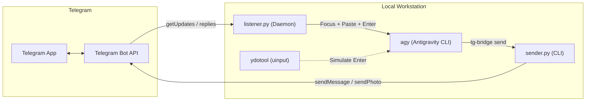

# tg-bridge: Antigravity Telegram Bridge

A headless bridge linking Telegram directly to active Google Antigravity (agy) CLI coding sessions on Linux (Wayland / GNOME).

Send prompts, code snippets, and image attachments from Telegram. The bridge automatically identifies the target session, brings the terminal window to focus, pastes the input (Ctrl+Shift+V), and presses Enter to submit the turn automatically.

When running multiple agents across different workspaces or terminals, replying directly to an agent's message on Telegram routes your response exclusively to that specific agent session.

---

## Features

- Multi-Agent Routing: Every outbound message tags the originating agent name and conversation title, recording the Telegram message ID. Replying to a message on Telegram routes your prompt directly to that specific agent session.
- Automated Session Discovery: Dynamically tracks which agy session is actively communicating. Falls back to the most recently active session when messages are not replies.
- Wayland Window Focus and Input Injection: Natively raises the target terminal window on GNOME Wayland and simulates Ctrl+Shift+V followed by KEY_ENTER via kernel uinput (ydotool).
- Image and Screenshot Support: Photos and image documents sent via Telegram are downloaded to ~/.local/share/tg-bridge/images/ and automatically formatted as [Image: /path/to/image] in the input prompt.
- Rich Outbound Formatting: Translates Markdown (headers, bold, italics, code blocks) into Telegram HTML and splits oversized outputs into chunks.
- Desktop Notifications: Provides immediate desktop feedback using notify-send with thumbnail previews.

---

## Architecture Overview



For complete sequence diagrams, reply-routing flows, and internal design, see [ARCHITECTURE.md](ARCHITECTURE.md).

---

## Quick Start

### 1. Requirements
- Linux (Fedora / Ubuntu / Arch with GNOME Wayland or X11)
- Python 3.9+ with psutil
- wl-clipboard (wl-copy)
- ydotool (configured with systemd service and uinput access)

### 2. Setup Credentials
Create ~/Documents/tg.txt containing your Telegram Bot Token on line 1 and your authorized user ID on line 2:
```text
1234567890:ABCdefGHIjklMNOpqrSTUvwxYZ
id: 987654321
```

### 3. Installation
Clone the repository and run the installer:
```bash
git clone https://github.com/jendermine/tg-bridge.git ~/projects/tg-bridge
cd ~/projects/tg-bridge
./install.sh
```

### 4. Setup Input Injection Permissions
Run the uinput setup script once to grant ydotool permissions:
```bash
./integrations/setup-uinput.sh
```

### 5. Start the Service
```bash
tg-bridge start
```

---

## Emergency hotline

The listener handles these Telegram commands itself, so they work even when the
Claude desktop app (or any agent session) is hung or closed:

| Command | What it does |
|---|---|
| `/status` | Load, memory, heaviest processes, running builds/pushes |
| `/stop` | Stops runaway work: Gradle/Kotlin daemons, git push/pack-objects, adb screenrecord |
| `/killapp` | Force-quits a hung Claude desktop app |
| `/ask [project] <message>` | Read-only help in `~/projects/<project>` (default `keyboardme`). Uses Claude Code (a fork of that project's latest conversation) if its CLI is signed in, otherwise Antigravity (`agy`) in plan mode. |
| `/do [project] <message>` | Like `/ask`, but Antigravity may edit files and run commands in the project. |
| `/help` | Lists the commands |

## CLI Usage

tg-bridge includes a management and dispatch CLI:

```bash
# Service management
tg-bridge start       # Start the bridge daemon
tg-bridge stop        # Stop the bridge daemon
tg-bridge restart     # Restart the daemon
tg-bridge status      # View daemon status
tg-bridge logs        # Stream real-time logs (journalctl)

# Outbound messaging (automatically detects agent and conversation title)
tg-bridge send "Task finished! Here are the results..."
tg-bridge send /path/to/screenshot.png "Visual review"
cat report.md | tg-bridge send

# Explicit agent or title overrides
tg-bridge send --agent "Database Refactorer" --title "Schema Migration" "Migration completed."
tg-bridge send --no-header "Raw message without header tag"
tg-bridge send --no-record "Send without recording a session or message mapping"

# Claude Code sessions only
tg-bridge inbox                 # print queued replies for this session and mark them read
tg-bridge inbox --peek          # print without marking read
tg-bridge inbox --wait [SECONDS] # block until a reply arrives (default 1800s, exit 3 on timeout)
```

---

## Claude Code Sessions

Claude Code runs as a `claude` process spawned by the Claude desktop app, with no terminal or window to paste into. tg-bridge detects it by walking the caller's process tree and handles it through a separate inbox instead of input injection.

- Send: `tg-bridge send "<message>"` from a Claude Code tool shell. The header reads `[Agent: Claude Code | <cwd basename or --title>]`.
- Receive: reply on Telegram to that message. The listener appends it to `~/.local/share/tg-bridge/inbox/claude-<pid>.jsonl` and acks `Queued for Claude Code | <title> (PID n)`.
- Read: `tg-bridge inbox` prints `[tg <message_id>] <text> [Image: <path>]` lines and moves them to `claude-<pid>.done.jsonl`. `--peek` leaves them unread. `--wait [SECONDS]` blocks until at least one message exists (polls every 2s, default 1800s, exit 3 on timeout).
- Exit codes: 0 ok, 2 not called from a Claude Code session, 3 `--wait` timed out.
- Fresh message to Claude: start it with `/claude ` (the prefix is stripped). It goes to the most recently active live Claude Code session.

### Separation rules (agy and Claude Code never interfere)

- `active_session.json` is agy-only. Claude Code sessions are recorded in `active_session_claude.json`. `message_map.json` entries carry `"kind": "agy"` or `"kind": "claude"`; entries without `kind` are agy.
- Fresh (non-reply) messages always follow the agy behaviour (active agy session, else newest agy process), even if Claude Code sent last. Only `/claude ` messages go to Claude Code; if no Claude Code session is alive the message is acked as not delivered and nothing else happens.
- Replies to an agy message go to agy exactly as before.
- Replies to a Claude Code message go to that session's inbox. If that session has ended, the reply is acked as not delivered and is never sent to agy.
- Claude Code routing never touches agy's input path: no clipboard (`wl-copy`), no window focus, no paste, no `ydotool`. Only `notify-send` is used.
- Listener acks call `sender.py --no-record`, so they never write `active_session.json` or `message_map.json`.

---

## Multi-Agent Workflow Integration

When pairing with Google Antigravity, add the following instruction to your AGENTS.md or GEMINI.md:

```markdown
## Telegram Bridge Service (tg-bridge)

When the user requests Telegram updates or when running headless/remote tasks:
- Send update: tg-bridge send "<message>"
- Send image: tg-bridge send /path/to/image.png "<caption optional>"
- Outbound messages automatically identify the active conversation title and agent name.
- When the user replies to a specific update in Telegram, input is routed directly to this session.
```

---

## License
MIT License. Created for pairing Antigravity with Telegram.
